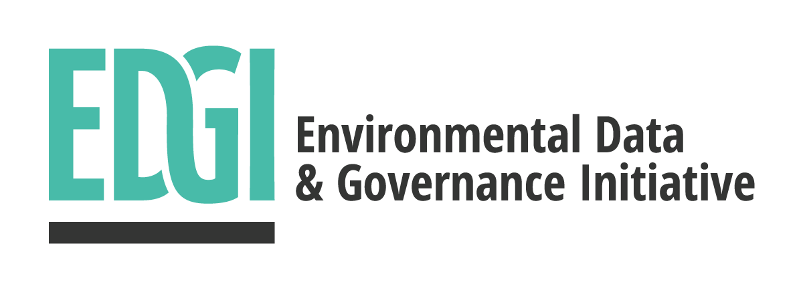

# Overview

Welcome to the [Environmental Data and Governance Initiative (EDGI)](https://envirodatagov.org/) Government Data Archiving technical team. We are building online tools, helping events, and creating research networks to proactively preserve, archive and track public environmental data and ensure its continued availability. We are indexing millions of government web pages on a weekly basis, tracking changes to them, and producing regular reports. Our focus has turned to using machine learning to sift through millions of government web pages to find the most important changes as well as working with the protocols for resilient, sustainable, distributed data storage networks. This repository is an overview for people who are getting involved in the project.

Our GitHub organization, chat, and in-person events have a [Code of Conduct](/CONDUCT.md) and [Contributor Guidelines](/CONTRIBUTING.md).

---

<table style="border: 0px;">
  <tr>
    <td align="left"><strong>EDGI participated in <a href="https://summerofcode.withgoogle.com/organizations/6574993514168320/">Google Summer of Code</a> for the first time in 2017</strong>!   Our mentoring team of six volunteer EDGI members worked with two students who contributed to our Archiving and Website Monitoring projects, you can read more   about their experience on our website: <a href="https://envirodatagov.org/summer-of-code/">envirodatagov.org/summer-of-code/</a></td>
    <td align="right"></td>
  </tr>
</table>

## Table of Contents

- [Get Involved](#get-involved)
- [Weekly Community Calls](#weekly-community-calls)
- [Projects](#projects)
- [Roadmap](#roadmap)
- [Working Openly](#working-openly)

## Get Involved

If you'd like to join the community and help improve these tools, great!

1. Review our [Contributor Guidelines](/CONTRIBUTING.md) and [Code of Conduct](/CONDUCT.md)
1. Jump on the [Archivers chat (archivers.slack.com)](https://archivers.slack.com/), anyone can request an invite from [archivers-slack.herokuapp.com slackin](https://archivers-slack.herokuapp.com/)
    - Introduce yourself in `#introductions`, key starting places for conversations are `#general`, `#dev` and `#community-building`
    - Ping one of the EDGI coordinators (@dcwalk, @patcon, or @mattprice) with your GitHub name to be added to the organization
1. Take a look at our [Current Projects](#projects), [Roadmap](#roadmap) and [Kanban Board](https://github.com/edgi-govdata-archiving/overview/projects/2)

**Note for IRC users:** (Advanced) If you prefer to use an IRC client, please review these [configuration instructions for Slack's IRC gateway](https://archivers.slack.com/account/gateways).

## Weekly Community Calls

Join us Thursdays at 6:30 ET (Eastern Time) at our [**weekly community call**](https://edgi-video-call-landing-page.herokuapp.com/https://zoom.us/j/508236833): [zoom.us/j/508236833](https://edgi-video-call-landing-page.herokuapp.com/https://zoom.us/j/508236833), call link also posted in slack and on our [events calendar](https://envirodatagov.org/events/).

**Recent Calls:** If you've missed a call check out our [recorded meetings](https://www.youtube.com/playlist?list=PLtsP3g9LafVsaa18lQaPXzxJU7wIcPB1O)!

## Projects

The following projects are actively being developed:

| 100 days | Archiving | Data Together | Web Monitoring | Website |
|---|---|---|---|---|
| Website for EDGI 100 Days Report at [100days. envirodatagov.org](https://100days.envirodatagov.org/) [**github.com/../100days**](https://github.com/edgi-govdata-archiving/100days) | Set of tools, workflows, and documentation for grassroots, event-driven, archiving | Distributed model for holding copies of archived and preserved data [**github.com/ datatogether**](https://github.com/datatogether) | Interface and backend for reviewing different versions of web pages [**github.com/../web-monitoring**](https://github.com/edgi-govdata-archiving/web-monitoring) | Project management and design support for EDGI's website at [envirodatagov.org](https://envirodatagov.org/) [**github.com/../edgi-website**](https://github.com/edgi-govdata-archiving/edgi-website) |

There are additional [`community`](https://github.com/edgi-govdata-archiving/overview/labels/community) and [`infrastructure`](https://github.com/edgi-govdata-archiving/overview/labels/infrastructure) projects that support internal EDGI and outreach processes:

| Tool Name | Description |
|-----------|-------------|
| [**EDGI Hubot**](https://github.com/edgi-govdata-archiving/edgi-hubot) | Chat bot for EDGI Slack built on the Hubot framework  |
| [**EDGI Scripts**](https://github.com/edgi-govdata-archiving/edgi-scripts) | Code scripts for running and maintaining our digital infrastructure |
| [**Video Call Landing Page**](https://github.com/edgi-govdata-archiving/video-call-landing-page) | Landing page app with important info that participants can be sent through prior to joining a video call   [http://edgi-video-call-landing-page.herokuapp.com/](http://edgi-video-call-landing-page.herokuapp.com/) |

## Roadmap

We have a technical [**Roadmap**](/ROADMAP.md) organized in planning cycles and we use a [Kanban Board](https://github.com/edgi-govdata-archiving/overview/projects/2) to work toward those milestones. In addition, each project covers specific tasks, issues, and milestones in individual repositories.

## Working Openly

We have developed guidelines for open project development in line with the horizontal-organizing principles EDGI operates under, these are all contained in this repo:

- [Volunteer Code of Conduct](/CONDUCT.md)
- [Contributing Guidelines](/CONTRIBUTING.md)
- [Community Call, Onboarding, and Project Guidelines](/guidelines)
