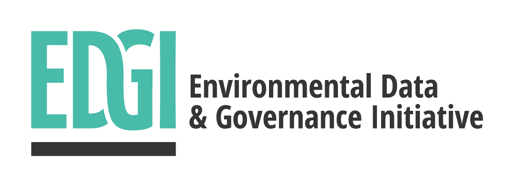

[

](https://envirodatagov.org/)

# Overview

Welcome to the [Environmental Data and Governance Initiative (EDGI)](https://envirodatagov.org/) Government Data Archiving team.

We are:
* Building online tools, helping events, and creating research networks to proactively preserve, archive and track public environmental data and ensure its continued availability
* Indexing millions of government web pages on a weekly basis, tracking changes to them, and producing regular reports
* Working with protocols for resilient, sustainable, distributed data storage networks

This repository is an overview for people who are getting involved in the project.

Our GitHub organization, chat, and in-person events have a [Code of Conduct](/CONDUCT.md) and [Contributor Guidelines](/CONTRIBUTING.md).

---

## Get Involved

Welcome to our community! We welcome contributors from many skillsets. Here's how to get started:

1. **Review our [Contributor Guidelines](/CONTRIBUTING.md) and [Code of Conduct](/CONDUCT.md)**
1. If You are just interested in contributing to code on GitHub, **take a look at our [Current Projects](#projects)** or jump straight into one of our [issues labeled “good-first-issue” or “help-wanted”][help-wanted]!
1. Otherwise, **[fill out our volunteer interest form][volunteer-form]** if you’d like to help with non-programming work or get more involved in the organization.

## Projects

Here are some projects we're building and maintaining right now.

**Want to get involved?** Check out the emoji column to see all the different types of contribution we need for these projects!

| Project (Click through to repo) | Description | Contribution type most needed ([emoji key from All Contributors](https://github.com/kentcdodds/all-contributors#emoji-key))|
| --- | --- | --- |
| [Web Monitoring](https://github.com/edgi-govdata-archiving/web-monitoring) | Tools around monitoring changes to government websites | [📖](# "Documentation")  [🐛](# "Bug reports") [💻](# "Code") |
|[100 Days](https://github.com/edgi-govdata-archiving/100days) | Website for EDGI 100 Days Report at [100days. envirodatagov.org](https://100days.envirodatagov.org/) (in maintenance) | [🐛](# "Bug reports") |
| [EDGI Website](https://github.com/edgi-govdata-archiving/edgi-website) | Project management and design support for EDGI's website at [envirodatagov.org](https://envirodatagov.org/) | [🐛](# "Bug reports") [💻](# "Code") [🎨](# "Design") [🤔](# "Ideas & Planning") [🖋](# "Content (e.g. website copy)") |
| [EDGI Scripts](https://github.com/edgi-govdata-archiving/edgi-scripts) | Code scripts for running and maintaining our digital infrastructure | [📖](# "Documentation") [💻](# "Code") [✅](# "Tutorials") |
| [Environmental Enforcement Watch](https://github.com/edgi-govdata-archiving/Environmental-Enforcement-Watch) | Tools for open Environmental Data Justice analysis | [📖](# "Documentation") [🐛](# "Bug reports")  [💻](# "Code") |

## Working Openly

EDGI operates under horizontal-organizing principles. We have developed guidelines for open project development in line with these principles, which you can find in this repo:

- [Volunteer Code of Conduct](/CONDUCT.md)
- [Contributing Guidelines](/CONTRIBUTING.md)
- [Project Repo Guidelines](/repo_guidelines.md)

## Funding

*Our work is made possible through volunteer labor, grants, and direct tax-deductible donations from the public.*

**[Donate to EDGI][donate]** 

*([More about how EDGI is funded](https://envirodatagov.org/about/how-were-funded/))*

[donate]: https://envirodatagov.org/donate/
[help-wanted]: https://github.com/search?q=org%3Aedgi-govdata-archiving+label%3Agood-first-issue%2C%22good+first+issue%22%2Chelp-wanted%2C%22help+wanted%22+state%3Aopen&type=issues
[volunteer-form]: https://envirodatagov.org/volunteer/
