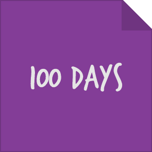
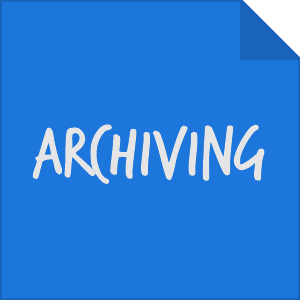
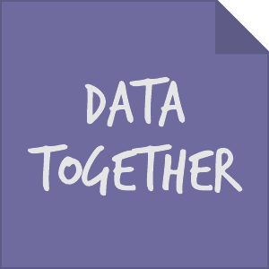
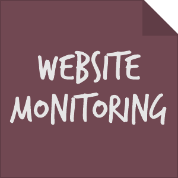

# Roadmap

This roadmap is organized by planning cycles and we use a [Kanban Board](https://github.com/edgi-govdata-archiving/overview/projects/2) to work toward established milestones. Project-specific labels track goals:

&nbsp;&nbsp;&nbsp;&nbsp;&nbsp;&nbsp;&nbsp;&nbsp;

In addition, each project covers specific tasks, issues, and milestones in individual repositories.

## [Summer 2017 Work Cycle (I)](https://github.com/edgi-govdata-archiving/overview/milestone/1)

1) Rolled out strategy for Data Together with an understanding of how we support it
2) Completed EPA archiving
3) Stable Web Monitoring v0/1 and analysts working on it. Positioning Web Monitoring to move into Filtering and Refining UI with gusto
4) Identified future projects and EDGI process improvements that tech team can assist with

## [Fall 2017 Work Cycle (II)](https://github.com/edgi-govdata-archiving/overview/milestone/2)

1) Reflection on the initial roll out of Data Together model
2) Iteration of web monitoring that can has been expanded to additional purposes beyond EDGI
3) Diverse tech team with clear sense of responsibilities and depth of care
4) Strong connections to relevant archiving, grassroots tech, data literacy efforts
